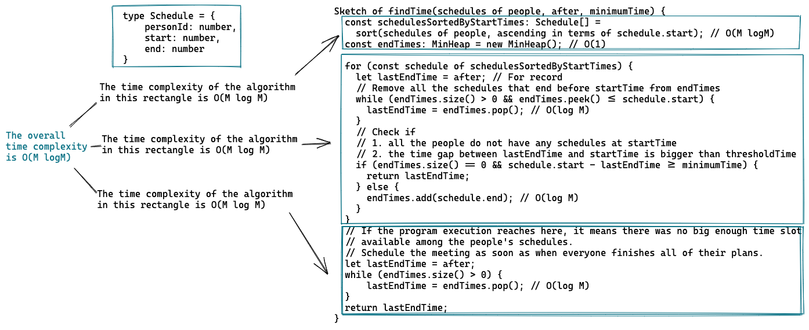
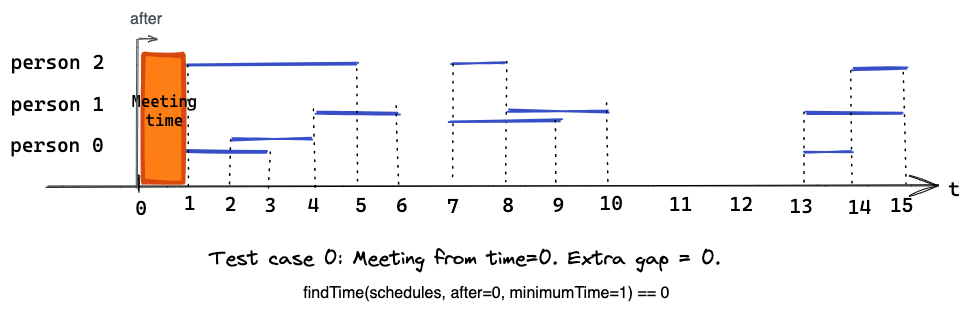
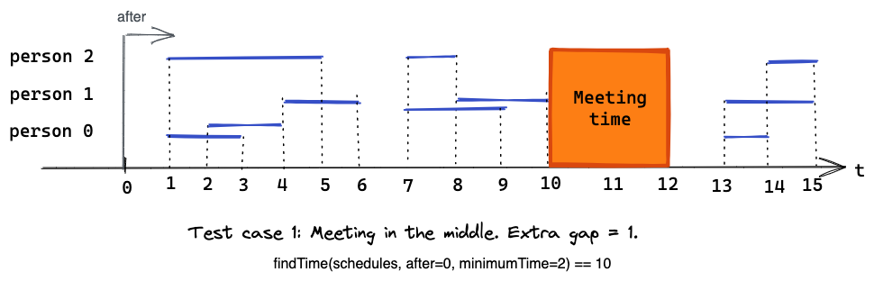
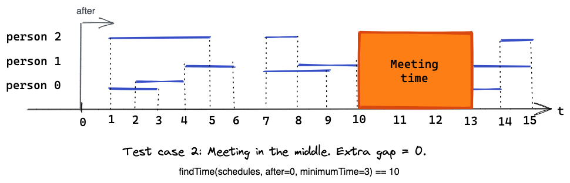
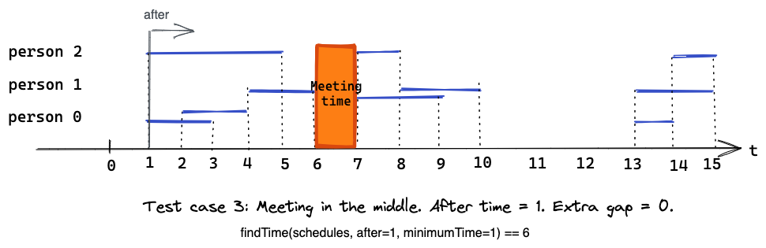
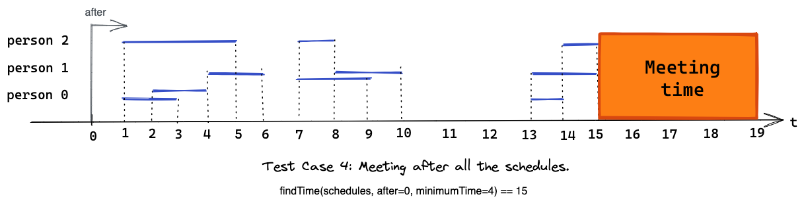

# Time Finder

TypeScript implementation of Time Finder.

## System Requirements

- node: v16.0.0
- yarn: 1.22.10

## How to Run

```bash
git clone git@github.com:uztbt/timeFinder.git
cd timeFinder
yarn
yarn test
```

## Design Considerations

### What is the time complexity of my algorithm?

The time complexity of my algorithm (findTime()) is O(M log M), where M is the number of schedules passed as an argument. I think it is the optimal time complexity because I believe sorting an array of schedules is unavoidable to solve this problem.



### Why did I use a min-heap?

I used a min-heap to store unexpired end times in findTime(). I needed the storage of unexpired end times to be efficient for both popping and insertion. A min-heap is the ideal data storage for those requirements because its popping and insertion only take O(log M). Please refer to the performance matrix of some data structures below.

| | Min-Heap | Sorted Linked List | Sorted Array |
| - |--|--|--|
| Popping | O(log M) | O(1) | O(1) |
| Insertion | O(log M) | O(M) | O(M) |


## Test Cases

The automated test confirm the program runs correctly in the following test cases.

### Test 0



### Test 1




### Test 2



### Test 3



### Test 4


