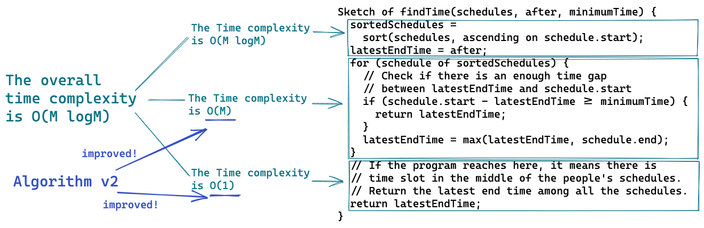

# Time Finder

TypeScript implementation of Time Finder.


## Input

- Schedules of people
- Point in time after which we find a time for the meeting
- Minimum amount of time for the meeting

## Output

- The earliest time to start the meeting

## System Requirements

- node: v16.0.0
- yarn: 1.22.10

## How to Run

```bash
git clone git@github.com:uztbt/timeFinder.git
cd timeFinder
yarn
yarn test

-------------|---------|----------|---------|---------|-------------------
File         | % Stmts | % Branch | % Funcs | % Lines | Uncovered Line #s 
-------------|---------|----------|---------|---------|-------------------
All files    |     100 |      100 |     100 |     100 |                   
 findTime.ts |     100 |      100 |     100 |     100 |                   
 minHeap.ts  |     100 |      100 |     100 |     100 |                   
-------------|---------|----------|---------|---------|-------------------
```

## Design Considerations

### What is the time complexity of my algorithm?

The time complexity of my algorithm, `findTime()`, is O(M log M), where M is the number of schedules passed as an argument. I think it is the optimal time complexity because I believe sorting an array of schedules is unavoidable to solve this problem in any way.



### Why did I use a min-heap?

I used a min-heap to store unexpired end times in `findTime()`. I needed the storage of unexpired end times to be efficient for both popping and insertion. A min-heap is the ideal data storage for those requirements because its popping and insertion only take O(log M). Please refer to the performance matrix of some data structures below.

| | Min-Heap | Sorted Linked List | Sorted Array |
| - |--|--|--|
| Popping | O(log M) | O(1) | O(1) |
| Insertion | O(log M) | O(M) | O(M) |

Let me elaborate more on some of the time complexities I showed above. The height of a complete heap tree with M elements is log M. Popping from a min-heap takes O(log M) time because it invokes `siftDown(0)`. `siftDown()` is a recursive function, and it calls itself at most log M times in the worst case, e.g., when the sifting down item is the largest in a heap. Insertion to a min-heap also takes O(log M) time because it calls `siftUp(this.array.length-1)`, and its recursion chain becomes log M in length in the worst case, i.e., when the sifting up item is the smallest in a heap.

Insertion to a sorted linked list takes O(M) time. The worst case is when you iterate over all the items of the list to insert an item to the tail of it. Insertion to a sorted array also takes O(M) time. The worst case is when you insert an item at index 0 of the array; hence you have to shift all the elements by one to the right.

## Test Cases

The automated test confirm the program runs correctly in the following test cases.

### Test 0


### Test 1


### Test 2


### Test 3


### Test 4


